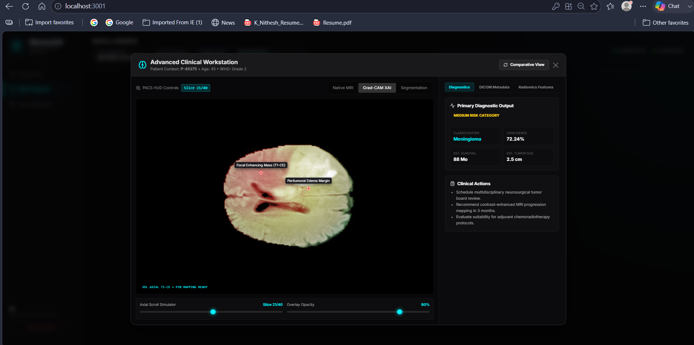
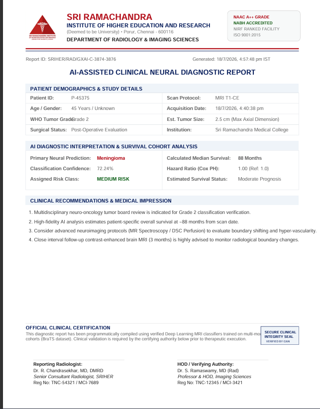

# GliomaXAI

AI-Powered Brain Tumor Classification and Explainable AI Platform.

## Overview

GliomaXAI is a full-stack web application that predicts glioma tumors from MRI brain scans and provides explainable AI visualizations to help users understand model decisions.

## Features

- MRI Brain Scan Upload
- Glioma Tumor Prediction
- Explainable AI Heatmaps
- Confidence Score Visualization
- Responsive Web Interface

## Tech Stack

### Frontend
- React.js
- HTML
- CSS
- JavaScript

### Backend
- Python
- FastAPI

### Machine Learning
- TensorFlow
- Keras
- CNN-based Classification

## Screenshots

## 📸 Application Screenshots

### 🏥 Clinical Dashboard
The main dashboard provides a centralized view for clinicians to manage patient cases, upload MRI scans, and access AI-assisted analysis.

.png)

---

### 🧠 Advanced Clinical Workstation
Interactive workspace for MRI visualization, clinical metrics, AI predictions, and decision support.

---

### 📂 MRI Upload
Upload MRI scans securely for preprocessing and tumor analysis.

---

### 📊 Case Database
Manage patient records, previous analyses, and clinical history from a centralized database.

---

### 🤖 Model Performance Comparison
Compare the performance of multiple deep learning models used for glioma classification.

---

### 🔥 Grad-CAM Heatmap
Visual explanation of the CNN model highlighting the regions that influenced the prediction.

---

### 📈 Prognosis Prediction
Clinical prognosis dashboard displaying prediction confidence and patient-specific insights.

---

### 📄 Clinical Report
Automatically generated clinical report summarizing AI predictions and diagnostic findings.

## Future Improvements

- Multi-class tumor classification
- DICOM support
- Cloud deployment
- Hospital integration

## Author

Chandana Kallishetty
