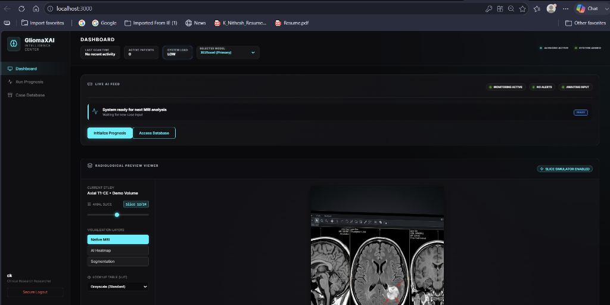
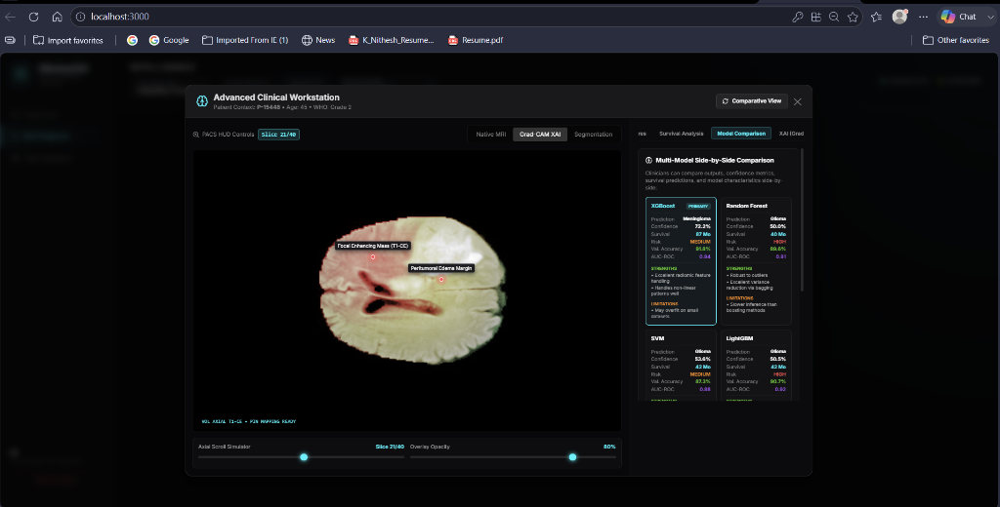
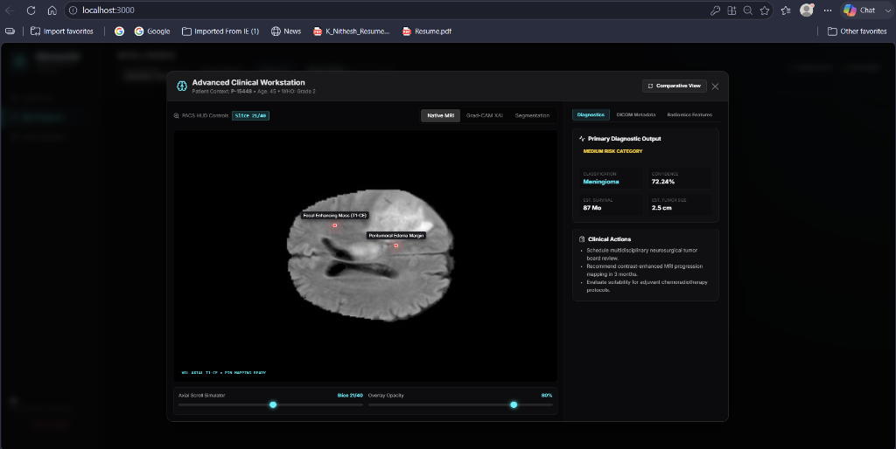
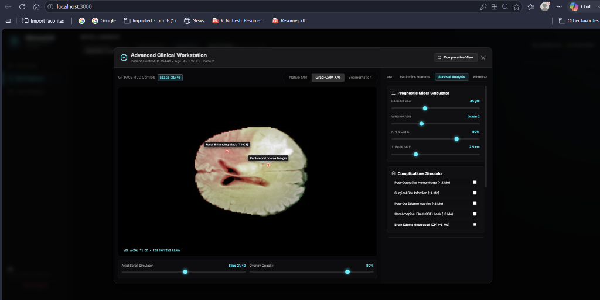

# GliomaXAI

AI-Powered Brain Tumor Classification and Explainable AI Platform.

## Overview

GliomaXAI is a full-stack web application that predicts glioma tumors from MRI brain scans and provides explainable AI visualizations to help users understand model decisions.

## Features

- MRI Brain Scan Upload
- Glioma Tumor Prediction
- Explainable AI Heatmaps
- Confidence Score Visualization
- Responsive Web Interface

## Tech Stack

### Frontend
- React.js
- HTML
- CSS
- JavaScript

### Backend
- Python
- FastAPI

### Machine Learning
- TensorFlow
- Keras
- CNN-based Classification

## Screenshots

### Home Page

### MRI Upload

### Prediction Result

### Heatmap Visualization

## Future Improvements

- Multi-class tumor classification
- DICOM support
- Cloud deployment
- Hospital integration

## Author

Chandana Kallishetty
